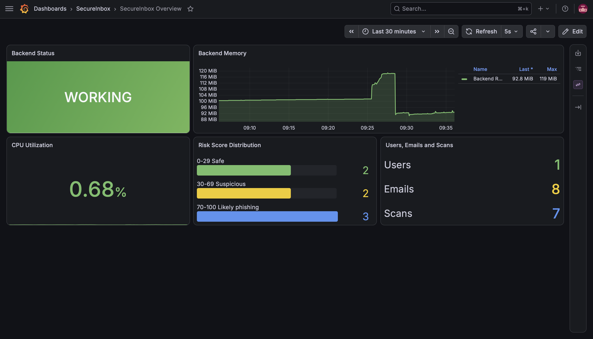
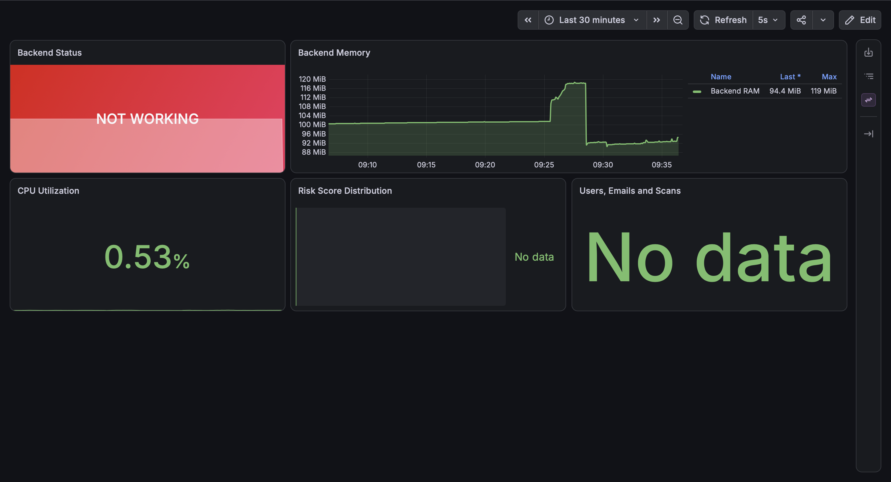
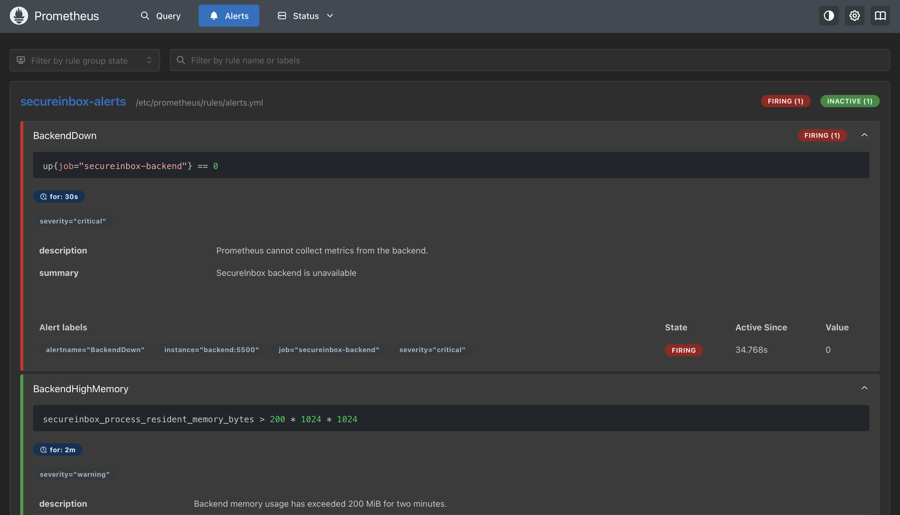

# ADR – Temă – Proiect de infrastructură IT - SecureInbox

În acest repo este soluția mea pentru proba practică - Proiect de infrastructură IT - pentru ADR Vest.
Am ales să nu folosesc o aplicație generică pentru demo, ci o variantă simplificată din SecureInbox, proiectul meu de licență.

Am eliminat conectarea cu Gmail, Google OAuth și procesarea AI locală, pentru că tema este despre
infrastructură, nu despre aplicație în sine. Am păstrat autentificarea, lista de
emailuri, scanările  și interfața, toate lucrând numai cu mock data.

Proiectul poate fi pornit prin Docker Compose, include monitorizare cu Prometheus și Grafana, două reguli de alertare și scripturi pentru provisioning, backup și restore.

## Pornire rapidă

Această instalare a fost testată pe macOS. Scriptul include și suport pentru provisioning pe Ubuntu.

Pe macOS este necesar ca Docker Desktop să fie instalat și pornit înainte de rularea scriptului `provision.sh`.

```bash
git clone https://github.com/AndreiStolojan/adr-tema-infrastructura-secureinbox.git
cd adr-tema-infrastructura-secureinbox
```

Pe macOS, scriptul se rulează fără `sudo`:

```bash
./scripts/provision.sh
```

Pe Ubuntu, scriptul se rulează cu `sudo`:

```bash
sudo ./scripts/provision.sh
```

Pe Ubuntu, scriptul instalează Docker Engine și pluginul Compose din repository-ul oficial Docker. Pe ambele sisteme generează `.env` dacă lipsește, construiește imaginile, pornește serviciile, rulează scriptul de seed și verifică endpointurile importante.

Scriptul poate fi rulat de oricâte ori. Nu suprascrie `.env`, nu șterge volumele și nu
dublează datele demo.

## Adrese și cont demo

După pornire:

| Componentă | Adresă | Rol |
|---|---|---|
| Aplicația Web | `http://localhost:8080` | Interacțiunea cu aplicația |
| Prometheus | `http://localhost:9090` | Alertele |
| Grafana | `http://localhost:3000` | Dashboardul cu metricile relevante |

Pentru acest demo, ne putem conecta atât pe un cont default creat automat cu datele:
```text
Email: demo@secureinbox.test
Parolă: Demo123!
```
dar și la crearea unui cont nou, acestuia îi este asociat automat un set de date fictive în baza de date, astfel încât funcționalitățile aplicației să poată fi demonstrate imediat.

Utilizatorul Grafana este `admin`. Parola Grafana este generată la prima rulare
și poate fi găsită în fișierul `.env`, în variabila `GRAFANA_ADMIN_PASSWORD`.

```text
Utilizator: admin
Parolă: valoarea GRAFANA_ADMIN_PASSWORD din .env
```

## Arhitectură

Am separat infrastructura în cinci servicii:

| Serviciu | Rol |
|---|---|
| `frontend` | construiește aplicația React, o servește cu Nginx și funcționează ca reverse proxy |
| `backend` | API Express și funcționalitățile aplicației |
| `mongodb` | baza de date locală a aplicației |
| `prometheus` | colectează metricile și evaluează alertele |
| `grafana` | afișează dashboard-ul |

Nginx publică aplicația pe portul `8080`; pentru `/api/v1/*` cererea este trimisă intern la `backend:5500`.
Backendul și MongoDB sunt accesibile numai în rețeaua Docker. Prometheus și Grafana sunt legate de `127.0.0.1` (localhost).

## Configurare

`.env.example` documentează variabilele necesare. Scriptul `provision.sh` generează automat fișierul local `.env` și valorile secrete cu `openssl`.

Variabilele principale sunt:

| Variabilă | Utilizare |
|---|---|
| `APP_PORT` | portul public Nginx |
| `FRONTEND_APP_URL` | originea acceptată de backend |
| `MONGO_DATABASE` | numele bazei aplicației |
| `MONGO_ROOT_*` | autentificarea MongoDB pentru demo |
| `JWT_SECRET` | semnarea tokenurilor de autentificare |
| `DEMO_USER_*` | contul creat de seed |
| `GRAFANA_*` | portul și contul administrator Grafana |

## Mock data

Aplicația folosește numai:

- `users`;
- `emails`;
- `scans`.

Rulare manuală:

```bash
docker compose exec -T backend npm run seed
```

Seed-ul folosește `upsert` și indexuri unice, deci rularea lui de mai multe ori păstrează același rezultat. Această comandă este apelată automat în scriptul `provision.sh`.


## Monitorizare

Backendul expune metricile intern la:
```text
http://backend:5500/metrics
```
Endpointul este citit intern de către Prometheus la fiecare cinci secunde.

Pentru a putea vizualiza dashboard-ul cu metricile relevante, utilizatorul trebuie conectat la localhost:3000, autentificat cu username-ul și parola menționate mai sus, click în stânga sus pe meniu, selectat `Dashboards` -> `SecureInbox`-> `SecureInbox Overview`.

Metricile folosite în dashboard includ:

- starea backendului (`WORKING` sau `NOT WORKING`);
- memoria RAM folosită de backend;
- numărul total de utilizatori, emailuri și scanări din MongoDB (relevant pentru aplicație);
- distribuția scanărilor în funcție de scorul de risc (relevant pentru aplicație):
  - `0–29` – Safe;
  - `30–69` – Suspicious;
  - `70–100` – Likely phishing;
- procentul de CPU folosit de backend.

## Alerte

Prometheus încarcă două reguli:

### BackendDown

Devine activă dacă backendul nu poate fi monitorizat timp de 30 de secunde.

### BackendHighMemory

Devine activă dacă procesul backend depășește 200 MiB timp de două minute. M-am gândit la această alertă deoarece folosirea ridicată a memoriei pe o perioadă îndelungată poate indica un număr mare de cereri simultane, un memory leak sau un alt comportament imprevizibil în backend. Aplicația originală folosește și un LLM local, iar într-o versiune completă a infrastructurii aș monitoriza separat și resursele consumate de acesta.

Testarea alertei:

```bash
docker compose stop backend
```

În `http://localhost:9090/alerts`, `BackendDown` trece prin:

```text
Inactive -> Pending -> Firing
```

După test:

```bash
docker compose start backend
```

Totodată, într-o variantă completă a infrastructurii aș adăuga și un manager de alerte cu trimitere de notificări, emailuri sau mesaje pe Slack.

## Demonstrarea monitorizării

Dashboardul Grafana în timpul funcționării normale:



Dashboardul după oprirea backendului:



Alerta `BackendDown` în starea `Firing`:



## Backup MongoDB

Scriptul de backup folosește `mongodump` din containerul MongoDB:

```bash
./scripts/backup-mongodb.sh
```

Scriptul:

1. verifică Docker și serviciul MongoDB;
2. oprește backendul pentru câteva secunde (pentru a nu se adăuga date noi în timpul backup-ului);
3. creează o arhivă BSON comprimată (formatul utilizat de mongo);
4. validează arhiva cu `mongorestore --dryRun`;
5. calculează SHA-256;
6. scrie un manifest cu numărul documentelor;
7. repornește backendul.

Fișierele de backup sunt create în `backups/` și nu sunt urcate în Git.

```text
secureinbox_demo-DATA.archive.gz
secureinbox_demo-DATA.archive.gz.manifest.json
```

Backupurile locale sunt suficiente pentru demonstrație. Într-un sistem real
le-aș copia și într-o locație separată sau într-un object storage, folosind regula 3-2-1.
## Restore MongoDB

Restore-ul înlocuiește baza de date `secureinbox_demo` cu cea salvată în arhivă:

```bash
./scripts/restore-mongodb.sh backups/NUMELE_BACKUPULUI.archive.gz --confirm-replace
```
Deoarece operația este distructivă, este necesară folosirea comenzii `--confirm-replace`.

Scriptul:

1. verifică arhiva, manifestul și suma SHA-256;
2. rulează `mongorestore --dryRun`;
3. oprește backendul;
4. șterge numai baza aplicației;
5. restaurează colecțiile și indexurile;
6. compară numărul documentelor cu manifestul;
7. repornește și verifică backendul, dacă acesta rula înainte.

## Provisioning

[`scripts/provision.sh`](scripts/provision.sh) este punctul principal pentru reproductibilitate.

Am ales Ubuntu pentru instalarea automată deoarece este una dintre cele mai folosite distribuții Linux pentru servere și mi-a permis să verific provisioningul într-o mașină virtuală. Pe celelalte distribuții, scriptul poate fi rulat la fel ca pe macOS dacă Docker, Docker Compose, cURL și OpenSSL sunt deja instalate.

Pe Ubuntu:

- verifică dacă sistemul este Ubuntu atunci când Docker trebuie instalat;
- instalează Docker din repository-ul oficial dacă lipsește;
- pornește și activează serviciul Docker.

Pe macOS:

- verifică Docker Desktop și pluginul Compose;
- verifică dacă motorul Docker rulează;
- afișează o eroare dacă Docker Desktop trebuie pornit.

Apoi, pe ambele sisteme:

- generează `.env` doar dacă lipsește;
- construiește și pornește stack-ul;
- așteaptă conexiunea backend-MongoDB;
- rulează scriptul pentru popularea bazei de date cu date fictive;
- verifică aplicația, Prometheus și Grafana.

Scriptul a fost rulat local de mai multe ori peste același mediu. `.env` a rămas neschimbat.

Am făcut și un test separat de reproductibilitate pe macOS, într-un folder curat, fără `.env` și fără volume Docker. Am rulat numai `./scripts/provision.sh`, iar scriptul a generat configurația, a pornit serviciile și a creat datele demo. Backupul, restore-ul și alertele au fost testate separat în mediul rezultat.

Scriptul folosește `openssl` pentru a genera automat parole. Pe Ubuntu, `openssl` este instalat automat de script, iar pe macOS este necesar să fie deja disponibil.

Disponibilitatea lui poate fi verificată cu:

```bash
openssl version
```
## Comenzi de testare recomandate pentru CLI

Crearea serviciilor:

```bash
git clone https://github.com/AndreiStolojan/adr-tema-infrastructura-secureinbox.git
cd adr-tema-infrastructura-secureinbox
sudo ./scripts/provision.sh
curl -fsS http://localhost:8080/api/v1/ready && echo "MERGE"
sudo docker compose ps
```

Test login:

```bash
curl -fsS http://localhost:8080/api/v1/auth/login \
  -H 'Content-Type: application/json' \
  -d '{"email":"demo@secureinbox.test","password":"Demo123!"}'
  ```

Verificare Aplicatie, Prometheus si Grafana:

```bash
curl -fsS http://localhost:8080/api/v1/ready && echo " Aplicatie OK"
curl -fsS http://localhost:9090/-/ready && echo " Prometheus OK"
curl -fsS http://localhost:3000/api/health && echo " Grafana OK"
```

## Decizii și compromisuri

- Am păstrat MongoDB deoarece aplicația originală folosea deja modele potrivite
  pentru emailuri și scanări.
- Nu am adăugat healthchecks în Compose. Scriptul de provisioning verifică
  explicit readiness și afișează log-urile dacă backendul nu pornește.
- Am folosit utilizatorul root MongoDB pentru acest demo.

## Ce aș îmbunătăți dacă aș avea mai mult timp

- HTTPS cu certificat și redirect HTTP -> HTTPS;
- healthchecks declarate direct în Compose;
- utilizator MongoDB dedicat aplicației, fără drepturi root;
- Docker secrets sau un secret manager;
- Alertmanager;
- agregarea logurilor;
- separare mai clară între configurările dev și prod;

## Documentație folosită

- [Docker Compose](https://docs.docker.com/compose/)
- [MongoDB Database Tools](https://www.mongodb.com/docs/database-tools/)
- [Nginx reverse proxy](https://docs.nginx.com/nginx/admin-guide/web-server/reverse-proxy/)
- [Prometheus](https://prometheus.io/docs/introduction/overview/)
- [Grafana provisioning](https://grafana.com/docs/grafana/latest/administration/provisioning/)
